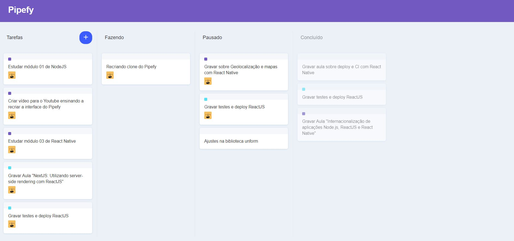

<h1 align="center">
    Pipefy Clone
</h1>

  <a href="#-tecnologias">Tecnologias</a>&nbsp;&nbsp;&nbsp;|&nbsp;&nbsp;&nbsp;
  <a href="#-projeto">Projeto</a>&nbsp;&nbsp;&nbsp;|&nbsp;&nbsp;&nbsp;
  <a href="#-como-usar">Como Usar</a>&nbsp;&nbsp;&nbsp;|&nbsp;&nbsp;&nbsp;
  <a href="#-como-contribuir">Como contribuir</a>

  

## 🚀 Tecnologias

Esse projeto foi desenvolvido com as seguintes tecnologias:

- [ReactJs](https://reactjs.org/)
- JavaScript
- HTML5
- CSS

## 💻 Projeto

Aplicação [React](https://reactjs.org/) desenvolvida com base na aula ministrada no canal da [Rocketseat](https://www.youtube.com/channel/UCSfwM5u0Kce6Cce8_S72olg). O principal intuito do projeto era desenvolver uma aplicação prática mais complexa com o React. No caso foi implementada uma funcionalidade _drag_ _and_ _drop_ nos cards da interface 

## 🔥 Como usar
- É necessário ter o [Node.js](https://nodejs.org/en/) e [npm](https://www.npmjs.com/) instalados
- Clone esse repositório: `git clone https://github.com/romaSilva/Pipefy-Clone.git`
- Instale as dependências do projeto, digitando no terminal: `npm install`
- Enfim, para rodar a aplicação digite: `npm start`
​

## ♻️ Como contribuir

- Faça um fork desse repositório;
- Cria uma branch com a sua feature: `git checkout -b minha-feature`;
- Faça commit das suas alterações: `git commit -m 'feat: Minha nova feature'`;
- Faça push para a sua branch: `git push origin minha-feature`.

Depois que o merge da sua pull request for feito, você pode deletar a sua branch.